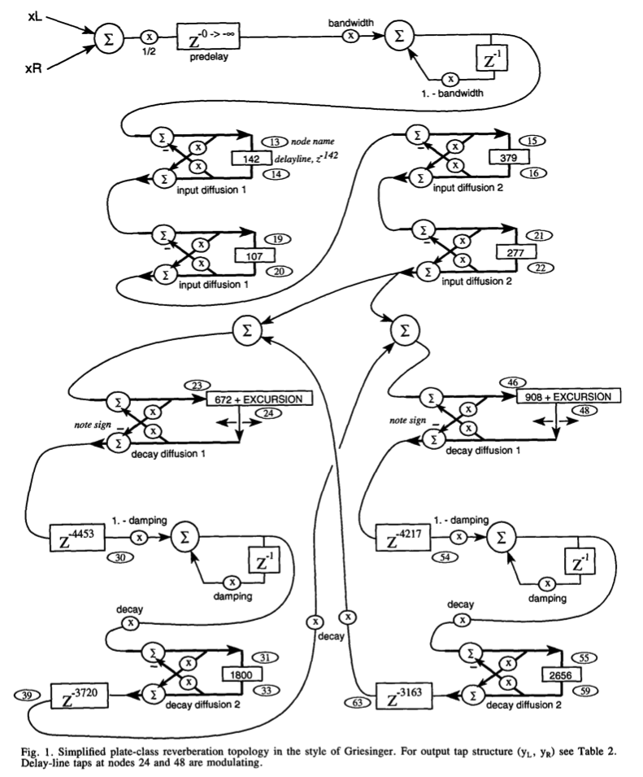

# Dattorro Verb

based on https://github.com/adion12/DaisyVerb (https://www.youtube.com/watch?v=PNHGs7RQc_o), 
which implements ***a plate reverberator “in the style of Griesinger” as proposed by Jon Dattorro.***
***Very close to the plate algorithms found on the original Lexicon 224.*** - https://kaseypocius.github.io/MUMT618-DREV/about.html.



## Getting the source

```git clone --recursive```

or

```
git clone 
git submodule update --init
```
